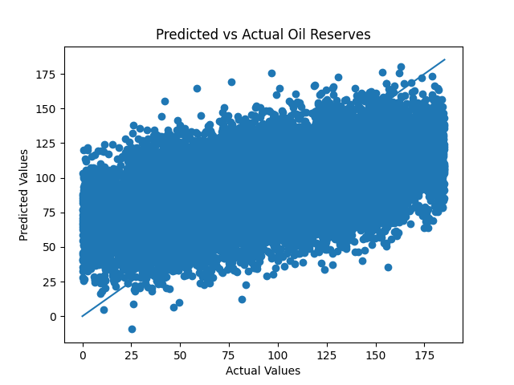
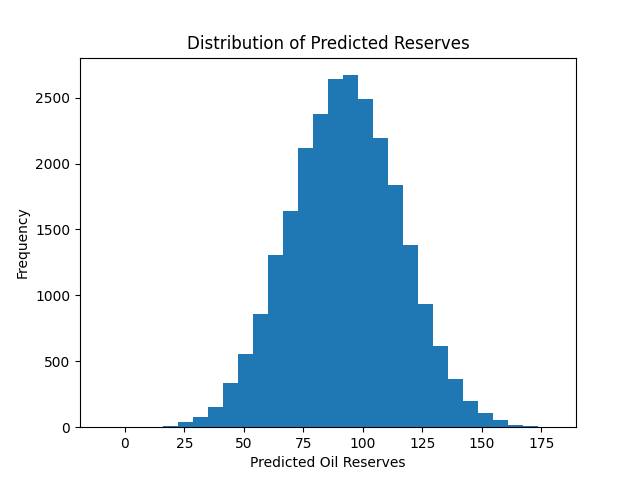
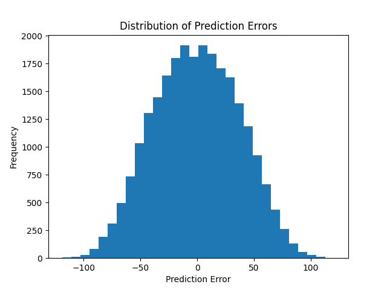

# Oil-Well-Optimization
Machine Learning project to optimize oil well selection and maximize profitability under uncertainty.

## Executive Summary
This project focuses on optimizing oil well location selection using machine learning techniques. 
By analyzing geological and production data, the model identifies the most profitable drilling locations while minimizing financial risk. The results support data-driven decision-making in resource extraction and investment planning.

## Project Overview
This project focuses on selecting the most profitable region to develop 200 oil wells using predictive modeling and risk analysis.

## Objectives
- Predict oil reserves using machine learning
- Select top-performing wells
- Maximize profit while minimizing risk
- Identify the best region for investment

## Tools & Technologies
- Python (pandas, NumPy, scikit-learn)
- Jupyter Notebook

## Methodology
- Data preprocessing and validation
- Train-test split (75/25)
- Linear Regression modeling
- RMSE evaluation
- Profit calculation based on business constraints
- Bootstrapping (1000 samples) for risk analysis

## Key Visualizations

### Predicted vs Actual Values

This plot compares predicted oil reserves against actual values. The closer the points are to the diagonal line, the better the model performance. The results show a reasonable fit, indicating that the model captures the general trend despite some prediction errors.

### Distribution of Predicted Reserves

This histogram shows how predicted reserves are distributed. It helps identify the typical range of expected production and detect any extreme values that could impact decision-making.

### Prediction Error Distribution

This visualization shows the distribution of prediction errors. A centered distribution around zero indicates that the model is not heavily biased, while the spread reflects the magnitude of prediction uncertainty.

## Key Metrics
- Budget: $100M
- Wells selected: 200
- Revenue per unit: $4500

## Key Findings
- Average reserves below profitability threshold → selection is critical
- Region 0 showed high profit but unacceptable risk (6%)
- Region 1 achieved:
  - Highest average profit
  - Risk < 2.5%
  - Stable confidence intervals

## Business Impact
- Data-driven decision-making reduces financial risk
- Bootstrapping provides reliable uncertainty estimation
- Optimal selection strategy is more important than average performance

## Conclusion and Final Recommendation

Based on the analysis, **Region 1 is the optimal choice for oil well development**, as it provides the best balance between profitability and risk.

While other regions may offer higher potential returns, they exceed the acceptable risk threshold (2.5%), making them less viable from a business perspective. In contrast, Region 1 delivers **stable expected profits with controlled risk**, supported by bootstrapping results and confidence intervals.

This indicates that prioritizing **risk-adjusted returns over maximum output** leads to more reliable and sustainable investment decisions.

Therefore, it is recommended to proceed with Region 1 for the development of the 200 oil wells.

This approach reduces the probability of financial loss while ensuring consistent returns, making it a robust strategy for investment planning.

## Next Steps
- Test more advanced models (Random Forest, Gradient Boosting)
- Incorporate more features for better predictions
- Real-time decision systems
